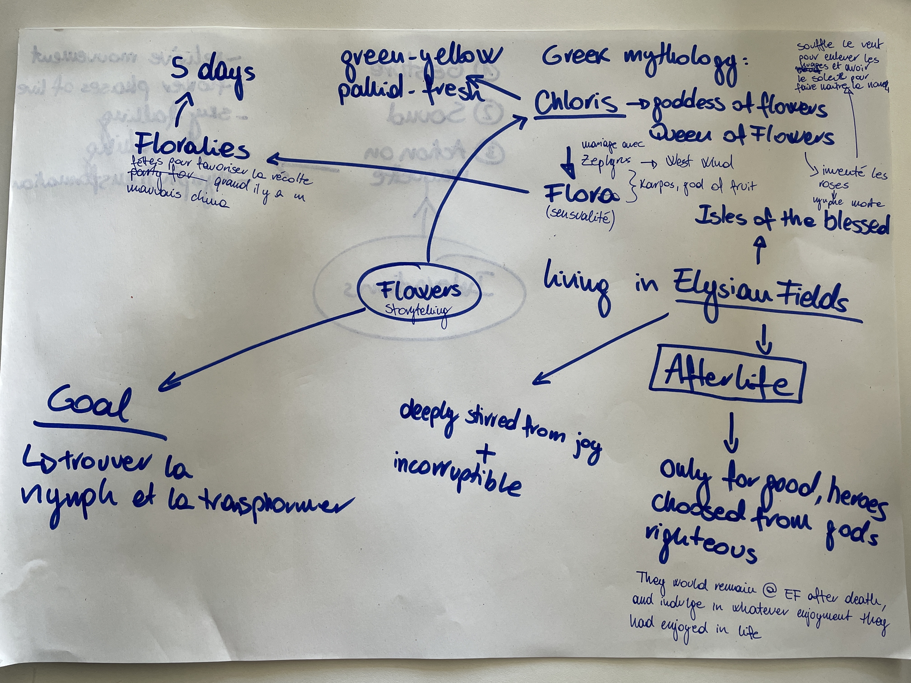
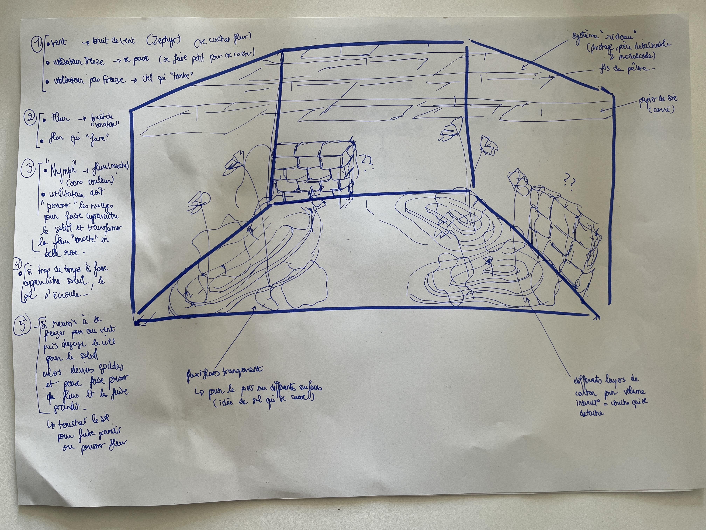

# 10.05.2023

This morning we presented the storytelling to Camille, because the idea had evolved a lot from last discussion

## FEEDBACK CAMILLE:

Really better from last time discussion, clear direction now. Maybe we can add some interaction between the dead nynphs. She liked the femminist message behind our idea, the community, helping other sisters and fighting the patriarchal sosciety of elysian fields.

## FEEDBACK SABRINA:

TOO MANY INTERACTIONS! We should reduce the storytelling to the essential, the meaning behind every feature.

1. Moving around the scene as "Chloris"  
   This means to create a environnement and create the "Chloris" character (nynph version) for the maquette.
2. Take a special power 
   While exploring the environnement, we can interact with some assets and "grab" a power. For the maquette we should have where is physically the power, for exemple the fountain for the drop of elysir. The power will be represented as token for the experience in the maquette.
3. Give the special power 
   If we have a power, we can give it to the death nynph. So we should have the death nynph asset.
4. Rose transformation  
   The dead nynph become a beautiful rose. So we need a rose for the physical maquette.
5. Flora transformation 
   After the transformation of the rose, we need to trasnform Chloris to Flora. So we need a flora for the maquette
6. Wind 
   The role of the wind stay the same, so the user needs to hide from the wind to not be kidnapped and not end the experience. If the experience end, you will lose your powers and restart everything. You will know that te wind is coming only thanks to the effects on the environnement and bey the sound of wind becoming more and more strong. To hide from the find, you need to cover your face (hands or textile?)
7. End of story 
   If we the user is not kidnapped by the wind, and it success the tranformation on Flora, Flora (the user) will starts floating into the sky and the environnement starts growing with her and having more and more beautiful flowers all around her. This will be a contemplatif space where user can stay how much she/he wants before ending the VR experience.

   We discuss about how to introduce the story to the user. We thinked about some internal dialogues for Chloris. This dialogues will introduce the danger of the wind, the need of powers to be able to transform the dead nynph and some poetics narratives.

