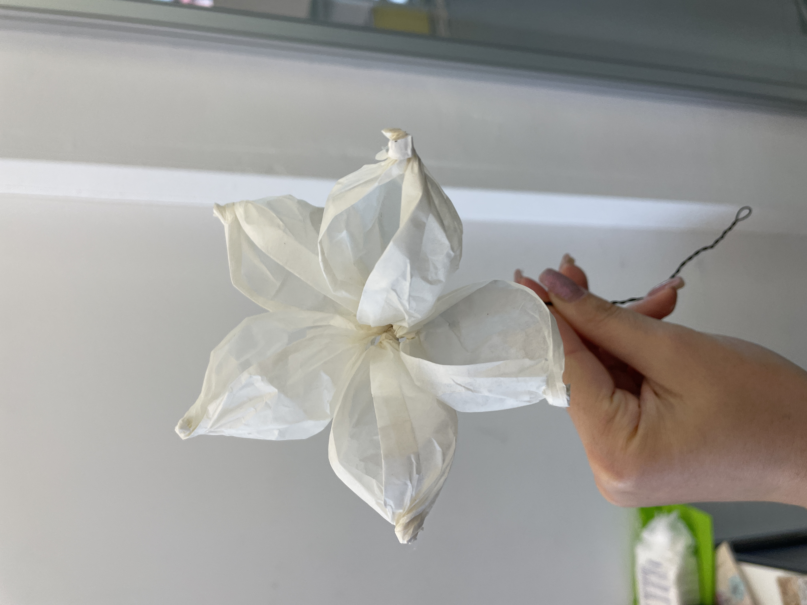

# 16.05.2023

This morning Michelle went to atelier prototypage. We laser-cutted in wood the shape for the support of the maquette and some "beans" to make some higher part on the landscape:

Marine went buy some others DIY materials.

We started playing with all material, but in particular with paper to create the first flowers:

## FEEDBACK SABRINA:

Add others "islands" where to hide the powers, a sort of "puzzle" of island that will create the playable space in VR.
