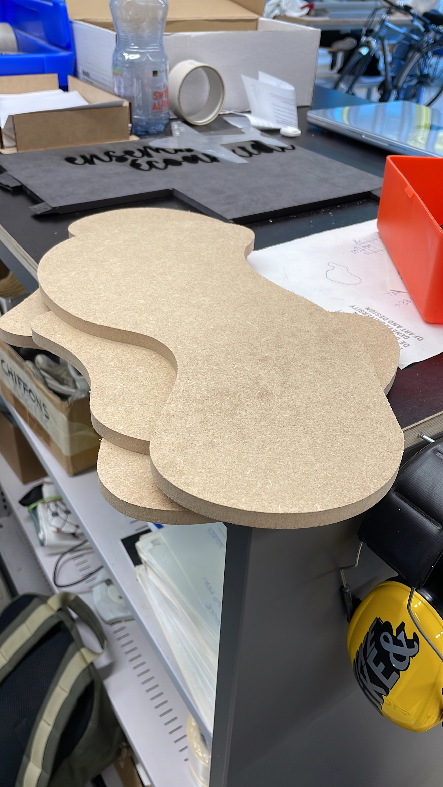
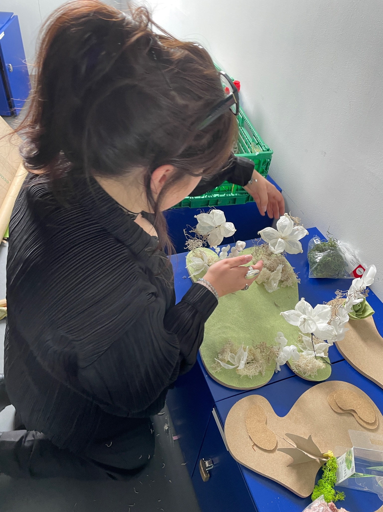
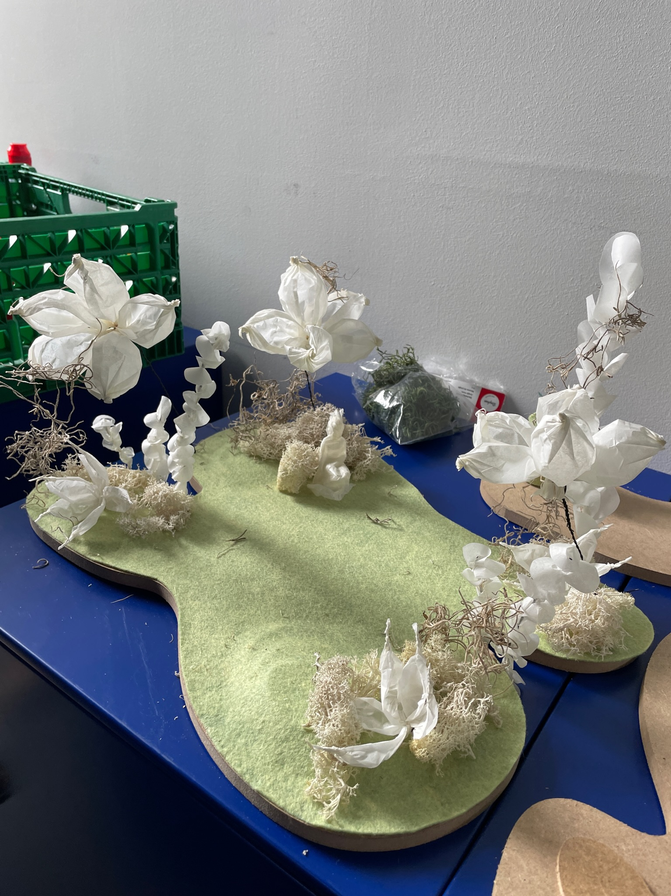
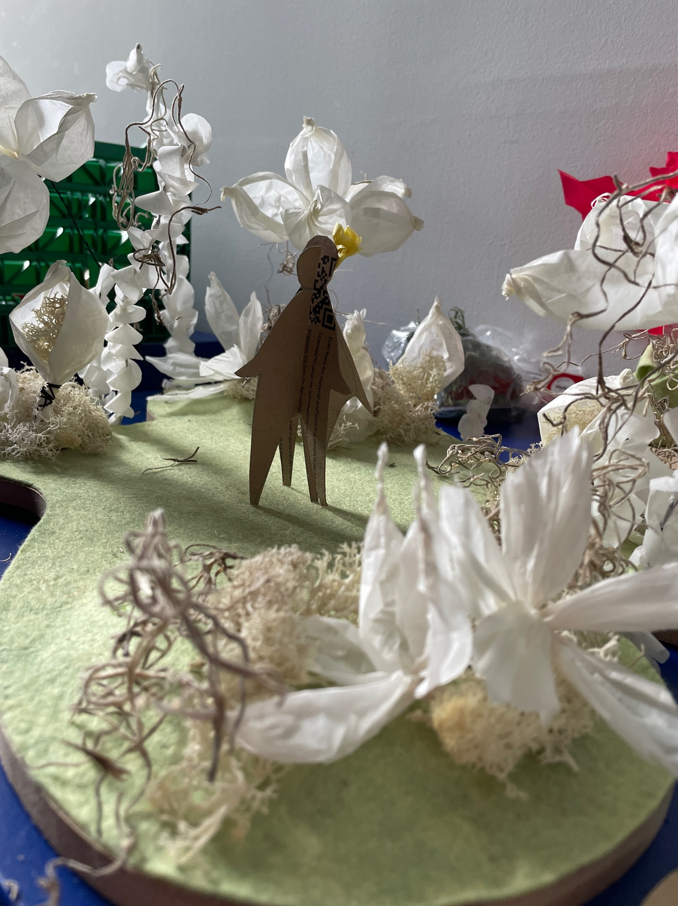

# 17.05.2023

We went to the atelier prototype for other islands and higher beans.
we reinvent the dead nymph form by starting with a nymph statuette printed in 3D and covering it with paper.
Then we thought about the rose and what to say in the presentation of the afternoon:

## PRESENTATION TEXT

For this project, we took inspiration from Greek mythology, in particular the story of the nymph Clhoris and the creation of the Rose.

One day, she was walking as usual in the Isle of Blessed (more commonly called the Elysian Fields, which represents paradise in Greek mythology), when she met a dead nymph on her way.

Saddened by the fate of the nymph, she wanders around the island, looking for help for the poor girl. She wonders why her sister died, she understands that it is probably the fault of the god of wind, Zephirus. Chloris will also have to be careful, if she hears the wind blowing, she will have to hide or she will die too.
All along the interactions, she will introduce thanks some "internal dialogues" to the user all the hints to continue the story.

By helping the dead nymph, she will be transformed into a beautiful rose and Chloris will be proclaimed goddess of flowers: Flora.

## SCANS

We tried to scan some paper assets with PolyCam to have an idea of the textures in 3D. Need to find an accurate technique, and good results but not perfects. Check the folder "assets/polycam" to see the 3D scans.

## ASSEMBLAGE MAQUETTE

To be able to show a preview of our concept during the class presentation, we tried to create a first maquette with all the assets created in these days:

## FEEDBACKS PRESENTATION
