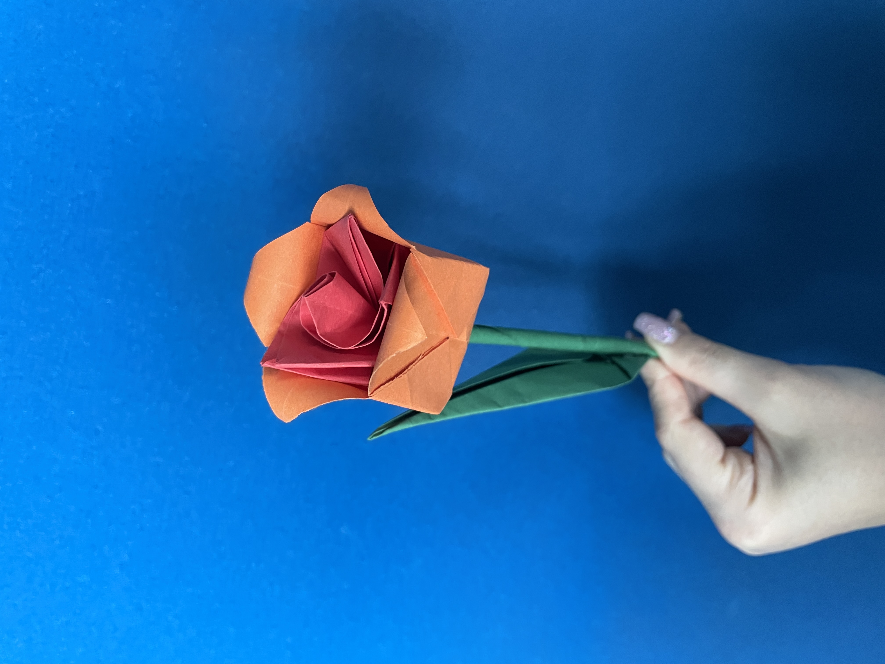
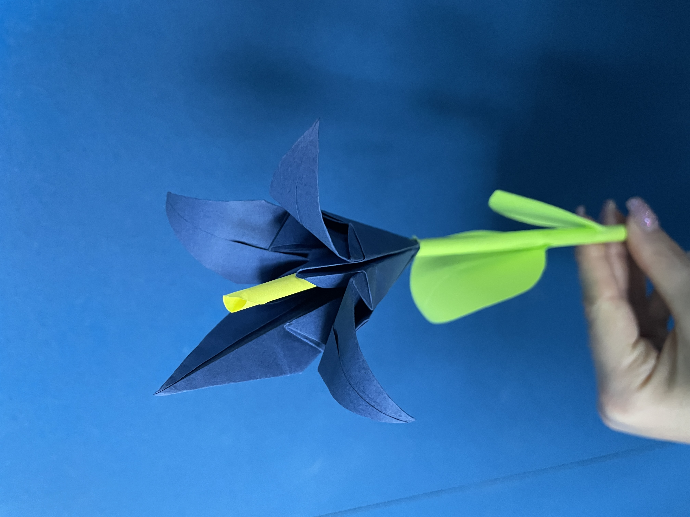

# 08.05.2023

Aujourd'hui les profs nous ont donné le brief, donc une experience poetique VR avec des interactions que avec les mains de l'utilisateur.

On a commencé à penser au concept du projet, on aimerais bien partire sur un espace d'un champ de fleurs, avec une esthetique super colorée. En plus que ca, la personne dans le champ peux recrer des bouquet des fleurs et donc interagir ave cfleur, leur couleurs, sons,...

On a reflechis aussi au fond écologique du projet, parce que les fleur coupées poivent être vraiment poullouant et pas du tout écologiques. Donc ce projet pourrais representer les problèmes du système actuel, derrière le geste de offire un fleur à quelqu'un.

Un espace collaboratif en ligne sur figjam a été mit en place pour pouvoir brainstormer:
https://www.figma.com/file/lOOZll2MC7q4JyETIqAKb8/flower-power?type=whiteboard&node-id=0%3A1&t=I8zm9kqg6ffK9pqX-1

On a essayé des maquettes de fleures origami:

