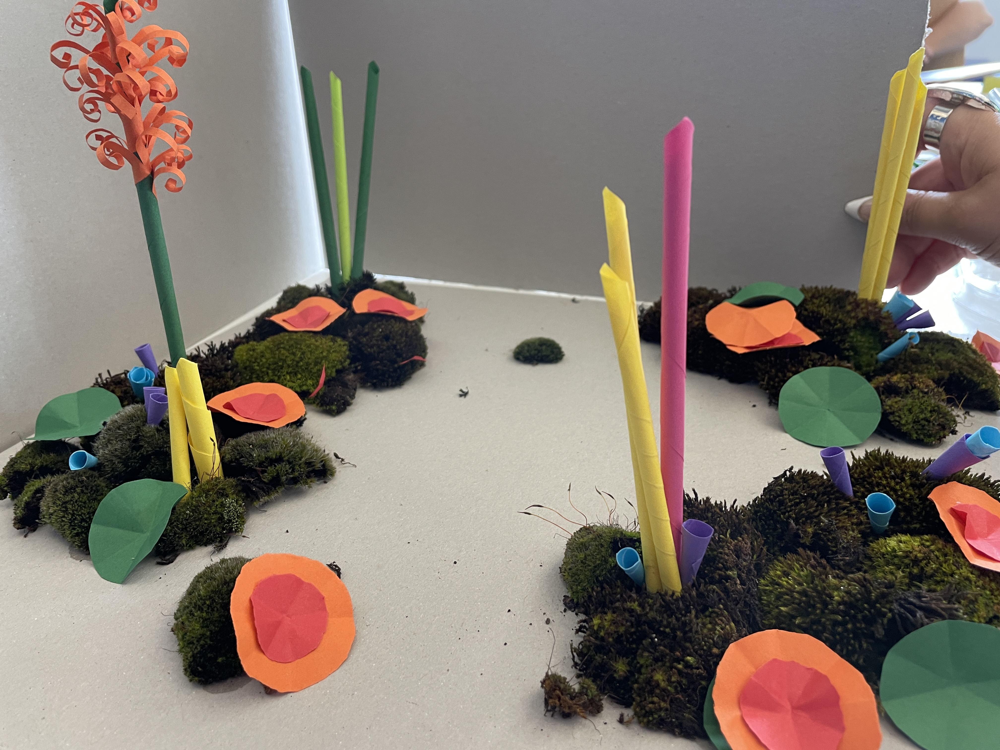

# 10.05.2023

This morning we tried to create a maquette scene, more than just some objects.
We agree on create an oniric experience concept, with beautiful non realistic (alien-style) flora.
When somebody interact with the fauna, the world starts destroy, as a mataphor on how we are treating the nature nowadays.

Before the first Unity lesson, we tried to build a scene with musc and our assets of yesterday:

