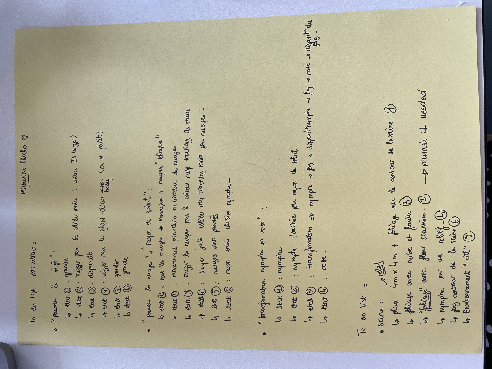

# 07.06.2023

Discussion with pierre, we have done a to do list for coding the entire scene and interactions:

We added a FPS counter, but seems to bug. Need to check that another time.

Then we started create the scene with our assets, but we saw they were too much heavy in Polygons count, so we have reduce the polycount in c4d and builded a first scene:

