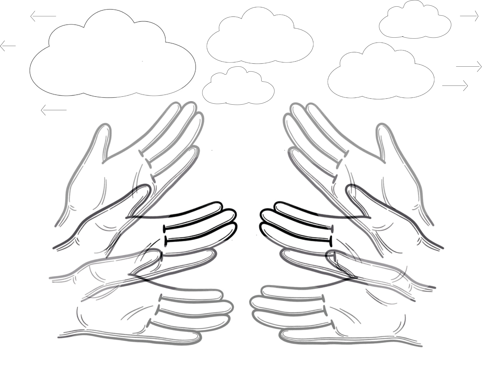
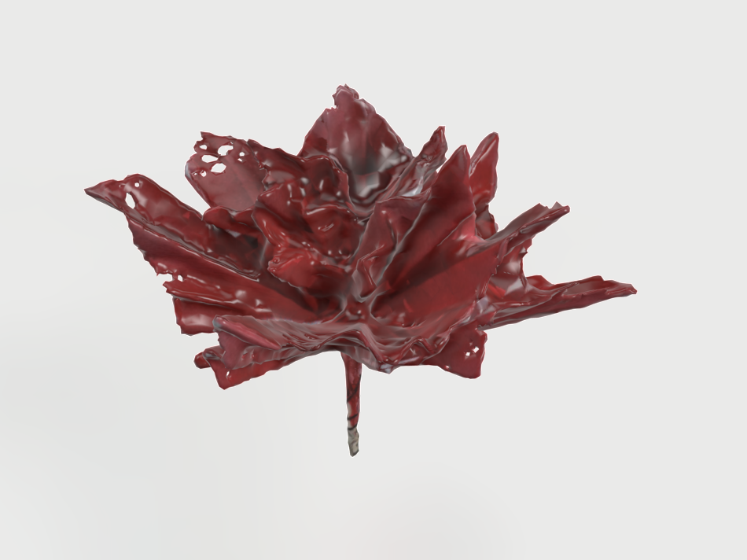

# Project Name ???

- Michelle PONTI, Marine FAROUD BOGET
- Master Media Design, HEAD-Genève

## Pitch

???? is a poetic Greek immersive experience in which you play the role of Chloris, a graceful nymph who wanders through the marvellous Champs Élysées. While this environment may seem magical and enchanted, it may also reveal a disturbing mythological mystery... Will you be able to solve it and become the goddess you really are?

## Synopsis

The user takes on the role of Chloris, a nymph who wanders the Elysian Fields of Greek mythology.
While exploring the enchanted landscape, the protagonist, unfortunately, discovers the inert body of another nymph in the vegetation.  
Chloris, expressing her thoughts of immense sadness, begins to wonder how her sister nymph could have died so unexpectedly. She blames Zephirus, the wind god, who must have tried to kidnap her in order to make her his wife. 
Despite the danger represented by the sound of the wind coming closer, Chloris decides to try and pay homage to the nymph's remains: 
Raising her hands to the sky, Chloris (the user) tries to free the clouds in the sky and make the sun appear, whose rays will warm the nymph.

Unexpectedly, the nymph is magically transformed into a magnificent red rose that blooms. 

All the flowers in the chosen fields turn colourful for this speel and Chloris (the user), for her empathetic gesture, is proclaimed by the other gods to be "Flora, the goddess of flowers". With the landscape transformed and freed by the clouds, Flora will be able to wander through this plant paradise.

## Visual Interaction Loop

The user finds the dead nymph, and sad about his fate decides to help her. She/he clears the clouds from the sky with a hand gesture to make the sunlight appear. The dead nymph turns into a rose, all the flowers turn red and the user Chloris becomes Flora, the goddess of flowers.

## POV

- Chloris: in Elysian Field, a neutral environment made up of flowers and vegetation in shades of white and beige.
- Flora: all the flowers of the landscape are coloured red, a new point of view on the scene.

## Assets

- Models:

  - Flowers (6)
  - Rose
  - Dead Nymph
  - moss
  - clouds

- Gestures:

  - walking
  - hands pushing clouds

- Sounds:
  - wind
  - transformation/flower opening
  - clouds movement
  - background music?

## State Machines

- Chloris:

  - Walking
  - Waiting
  - Moving hands and arms (XR kit)
  - Looking (XR kit)

- Nymph:

  - Waiting
  - Transforming
  - hatch
  - rose

- Flora:

  - Walking
  - Waiting
  - looking
